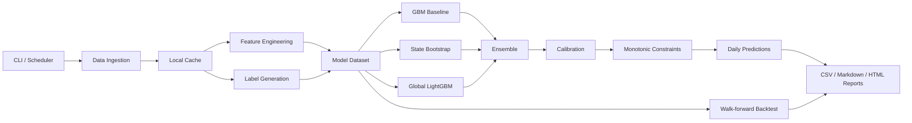

# A-Share Probability Research

A lightweight A-share probabilistic research system for daily-updated 60-day terminal return distributions and price-touch probabilities.

中文摘要：这是一个面向 A 股个股研究的轻量级概率预测系统，重点输出未来 60 个交易日的期末收益分布与关键价位触达概率，并在收盘后生成中文研究报告。当前以 `601727` 和 `002202` 为目标股票，训练时使用更大的相关股票池进行横截面建模。完整中文说明见 [README.zh-CN.md](README.zh-CN.md)。

This project focuses on two target stocks, `601727` and `002202`, while training on a broader cross-sectional universe of related A-share names. Instead of predicting a single target price, it estimates:

- terminal return bucket probabilities over the next 60 trading days
- touch probabilities for `+/-5%` to `+/-30%` price levels within the next 60 trading days
- a daily confidence flag and a Chinese analyst-style research report after the close

## Highlights

- focuses on modeling future return distributions instead of a single-point target-price guess
- separates `terminal distribution` and `touch probability` into two distinct but related prediction tasks
- combines `GBM`, `state bootstrap`, and `LightGBM` into a calibrated ensemble
- outputs CSV, Markdown, and HTML artifacts for both programmatic consumption and manual review
- emphasizes calibration with walk-forward backtesting and metrics such as `log loss`, `RPS`, `Brier`, and `ECE`

## Why This Project

Most retail-facing stock prediction projects reduce the problem to a single label such as "up or down tomorrow". This repository treats the task as a probability distribution problem:

- `terminal distribution`: where the stock is likely to finish after 60 trading days
- `touch probability`: whether the stock is likely to hit a target level at any point during that window
- `calibration`: whether a predicted 70% event actually behaves like a 70% event in historical validation

The goal is research quality and probabilistic interpretability, not trading automation.

## Architecture

The pipeline is organized into six layers:

1. `data ingestion`: AkShare/Eastmoney-based fetchers, caching, fallbacks, and universe resolution
2. `feature engineering`: price, volatility, momentum, volume, relative strength, valuation, and basic fundamental features
3. `label generation`: 60-day terminal return buckets and target-touch event labels
4. `modeling`: GBM baseline, state bootstrap baseline, and global LightGBM models
5. `calibration and constraints`: temperature scaling, isotonic calibration, and monotonic touch-probability constraints
6. `backtest and reporting`: walk-forward evaluation, metrics, plots, and daily HTML/Markdown reports



## Current Scope

- Target outputs: `601727` and `002202`
- Training mode: global cross-sectional model over a larger related-stock universe
- Update frequency: daily after market close
- Data frequency: daily bars only
- Not included in phase one: intraday refresh, NLP/news features, automatic execution

## Quick Start

1. Install dependencies:

```bash
python -m pip install -r requirements.txt
```

2. Refresh market data:

```bash
python run_cli.py refresh-data --config configs/default.json
```

3. Train the global model:

```bash
python run_cli.py train-global --config configs/default.json
```

4. Run walk-forward backtest:

```bash
python run_cli.py backtest --config configs/default.json
```

5. Generate prediction CSVs:

```bash
python run_cli.py score-daily --config configs/default.json
```

6. Generate the daily report:

```bash
python run_cli.py report-daily --config configs/default.json
```

7. Run the full daily pipeline:

```powershell
powershell -ExecutionPolicy Bypass -File scripts\run_live.ps1
```

## Repository Layout

```text
src/astock_prob/
  data/         data providers, caching, universe resolution
  features/     feature engineering
  labels/       forward return and touch-event labels
  modeling/     baselines, ML models, calibration, constraints
  backtest/     walk-forward evaluation
  reporting/    Markdown/HTML/chart generation
configs/        default and live-run configurations
docs/           architecture notes
scripts/        helper entrypoints
tests/          unit and integration tests
```

## Main Outputs

Files are written to `artifacts/reports/`, including:

- `daily_terminal_predictions.csv`
- `daily_touch_predictions.csv`
- `daily_model_health.json`
- `daily_report.md`
- `daily_report.html`

Typical outputs include:

- terminal return probability tables by stock and return bucket
- target-touch probability ladders for `+/-5%` to `+/-30%`
- confidence flags based on data completeness, drift, and recent model quality
- daily HTML summaries for manual review after market close

## Metrics Used

The project evaluates forecast quality with probability-aware metrics:

- `terminal_log_loss`
- `terminal_rps`
- `touch_brier_mean`
- `touch_ece_mean`

These metrics are intended to measure both predictive quality and calibration quality.

## Design Choices

- `daily bars only`: phase one prioritizes robustness and reproducibility over intraday complexity
- `cross-sectional training`: the model trains on a broader related-stock universe instead of only the target names
- `calibration-first`: predicted probabilities are treated as outputs that must be evaluated and calibrated, not just ranked
- `free-data aware`: the pipeline assumes API instability and uses local caching plus fallbacks

## Roadmap

- expand the live training universe closer to the configured `80-120+` names
- rerun full walk-forward backtests on the larger universe and refresh health scoring
- add sector-relative and market-regime features with stronger point-in-time validation
- improve report pages with richer charts and side-by-side model component diagnostics
- add optional CSV adapters for users who want to bypass unstable public APIs

## Notes

- Free data sources are convenient but not fully stable. Fetch latency, intermittent failures, and partial field coverage should be expected.
- This repository is a research system, not investment advice.
- Reported probabilities should be interpreted as model outputs under the available data and validation setup, not guaranteed market outcomes.
