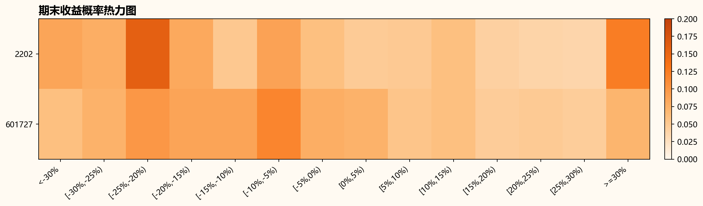
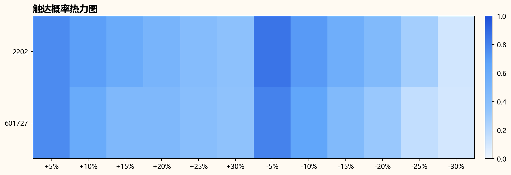
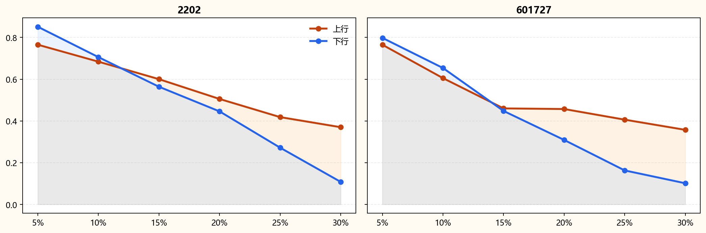

# 三个月概率预测日报

观察日: 2026-03-11

整体置信度: high

## 核心结论

- 2202: 最可能区间为 [-25%,-20%)，+20%/-20% 触达概率为 50.54% / 44.59%，当前置信度 unknown。
- 601727: 最可能区间为 [-10%,-5%)，+20%/-20% 触达概率为 45.72% / 30.91%，当前置信度 high。

## 最近 60 日模型质量

No rows.

## 模型健康度

| symbol | confidence_flag | drift_score | feature_missing_ratio | reasons |
| --- | --- | --- | --- | --- |
| 002202 | high | 0.86 | 0.0952 |  |
| 601727 | high | 0.7552 | 0.0952 |  |

| symbol | confidence_flag | most_likely_bucket | most_likely_prob | right_tail_prob | left_tail_prob | touch_up_20 | touch_down_20 | bias |
| --- | --- | --- | --- | --- | --- | --- | --- | --- |
| 2202 | unknown | [-25%,-20%) | 15.75% | 23.94% | 40.35% | 50.54% | 44.59% | 高波动震荡 |
| 601727 | high | [-10%,-5%) | 11.60% | 21.13% | 31.93% | 45.72% | 30.91% | 高波动震荡 |

| symbol | as_of_date | return_bucket | confidence_flag | ensemble_prob | gbm_prob | bootstrap_prob | ml_prob |
| --- | --- | --- | --- | --- | --- | --- | --- |
| 2202 | 2026-03-11 | <-30% | high | 8.62% | 3.62% | 7.74% | 11.81% |
| 2202 | 2026-03-11 | [-30%,-25%) | high | 7.75% | 1.88% | 4.77% | 10.78% |
| 2202 | 2026-03-11 | [-25%,-20%) | high | 15.75% | 2.62% | 22.32% | 46.49% |
| 2202 | 2026-03-11 | [-20%,-15%) | high | 8.22% | 2.88% | 9.87% | 9.85% |
| 2202 | 2026-03-11 | [-15%,-10%) | high | 5.09% | 4.00% | 2.42% | 2.57% |
| 2202 | 2026-03-11 | [-10%,-5%) | high | 8.90% | 3.50% | 12.90% | 10.91% |
| 2202 | 2026-03-11 | [-5%,0%) | high | 6.00% | 4.38% | 10.21% | 1.57% |
| 2202 | 2026-03-11 | [0%,5%) | high | 4.81% | 4.25% | 0.00% | 2.77% |
| 2202 | 2026-03-11 | [5%,10%) | high | 4.95% | 4.38% | 4.86% | 1.07% |
| 2202 | 2026-03-11 | [10%,15%) | high | 5.96% | 5.88% | 9.99% | 0.62% |
| 2202 | 2026-03-11 | [15%,20%) | high | 4.17% | 4.75% | 2.49% | 0.14% |
| 2202 | 2026-03-11 | [20%,25%) | high | 3.82% | 4.12% | 0.00% | 0.88% |
| 2202 | 2026-03-11 | [25%,30%) | high | 3.67% | 4.62% | 0.00% | 0.32% |
| 2202 | 2026-03-11 | >=30% | high | 12.28% | 49.12% | 12.42% | 0.22% |
| 601727 | 2026-03-11 | <-30% | high | 5.97% | 1.25% | 0.00% | 8.50% |
| 601727 | 2026-03-11 | [-30%,-25%) | high | 7.36% | 1.75% | 0.00% | 12.99% |
| 601727 | 2026-03-11 | [-25%,-20%) | high | 9.91% | 2.38% | 17.36% | 17.12% |
| 601727 | 2026-03-11 | [-20%,-15%) | high | 8.69% | 4.50% | 10.84% | 12.55% |
| 601727 | 2026-03-11 | [-15%,-10%) | high | 8.72% | 4.62% | 12.40% | 11.99% |
| 601727 | 2026-03-11 | [-10%,-5%) | high | 11.60% | 8.00% | 20.25% | 22.01% |
| 601727 | 2026-03-11 | [-5%,0%) | high | 7.75% | 8.12% | 5.08% | 8.69% |
| 601727 | 2026-03-11 | [0%,5%) | high | 7.41% | 11.12% | 9.99% | 3.58% |
| 601727 | 2026-03-11 | [5%,10%) | high | 5.43% | 10.00% | 2.37% | 0.71% |
| 601727 | 2026-03-11 | [10%,15%) | high | 6.01% | 9.88% | 7.14% | 0.60% |
| 601727 | 2026-03-11 | [15%,20%) | high | 4.62% | 7.50% | 2.37% | 0.10% |
| 601727 | 2026-03-11 | [20%,25%) | high | 4.85% | 8.12% | 2.32% | 0.30% |
| 601727 | 2026-03-11 | [25%,30%) | high | 4.55% | 5.38% | 4.83% | 0.21% |
| 601727 | 2026-03-11 | >=30% | high | 7.11% | 17.38% | 5.06% | 0.66% |

| symbol | as_of_date | return_bucket | direction | confidence_flag | ensemble_prob | gbm_prob | bootstrap_prob | ml_prob |
| --- | --- | --- | --- | --- | --- | --- | --- | --- |
| 2202 | 2026-03-11 | +5% | up | high | 76.54% | 93.75% | 72.71% | 34.77% |
| 2202 | 2026-03-11 | -5% | down | high | 85.14% | 66.25% | 90.24% | 98.39% |
| 2202 | 2026-03-11 | +10% | up | high | 68.41% | 87.38% | 60.11% | 24.98% |
| 2202 | 2026-03-11 | -10% | down | high | 70.59% | 48.25% | 85.26% | 89.77% |
| 2202 | 2026-03-11 | +15% | up | high | 60.02% | 82.00% | 57.73% | 17.49% |
| 2202 | 2026-03-11 | -15% | down | high | 56.39% | 34.12% | 75.06% | 89.84% |
| 2202 | 2026-03-11 | +20% | up | high | 50.54% | 77.50% | 47.60% | 13.11% |
| 2202 | 2026-03-11 | -20% | down | high | 44.59% | 25.37% | 59.72% | 84.69% |
| 2202 | 2026-03-11 | +25% | up | high | 41.84% | 71.50% | 32.26% | 21.42% |
| 2202 | 2026-03-11 | -25% | down | high | 27.20% | 16.38% | 37.28% | 75.84% |
| 2202 | 2026-03-11 | +30% | up | high | 37.01% | 66.62% | 27.38% | 5.76% |
| 2202 | 2026-03-11 | -30% | down | high | 10.80% | 9.25% | 17.38% | 26.63% |
| 601727 | 2026-03-11 | +5% | up | high | 76.52% | 82.50% | 54.66% | 42.09% |
| 601727 | 2026-03-11 | -5% | down | high | 79.81% | 59.00% | 75.80% | 99.10% |
| 601727 | 2026-03-11 | +10% | up | high | 60.52% | 70.62% | 31.30% | 12.87% |
| 601727 | 2026-03-11 | -10% | down | high | 65.38% | 35.75% | 58.44% | 84.27% |
| 601727 | 2026-03-11 | +15% | up | high | 46.02% | 59.25% | 24.13% | 6.45% |
| 601727 | 2026-03-11 | -15% | down | high | 44.80% | 20.75% | 53.63% | 71.77% |
| 601727 | 2026-03-11 | +20% | up | high | 45.72% | 48.12% | 14.58% | 5.00% |
| 601727 | 2026-03-11 | -20% | down | high | 30.91% | 11.62% | 28.20% | 66.44% |
| 601727 | 2026-03-11 | +25% | up | high | 40.62% | 35.50% | 14.58% | 7.54% |
| 601727 | 2026-03-11 | -25% | down | high | 16.29% | 5.25% | 20.57% | 34.28% |
| 601727 | 2026-03-11 | +30% | up | high | 35.74% | 26.38% | 14.58% | 4.22% |
| 601727 | 2026-03-11 | -30% | down | high | 10.15% | 2.38% | 12.59% | 10.87% |
