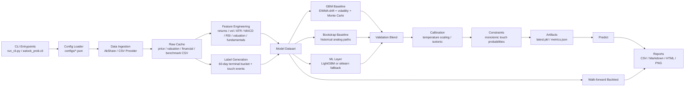

# Project Architecture

## Layer Notes

- CLI layer: exposes `fetch-data`, `train`, `backtest`, `predict`, and `run-live`.
- Data layer: fetches raw market and financial data, normalizes fields, and preserves existing cache on transient failures.
- Feature layer: converts time series into model-ready daily factors.
- Label layer: creates future 60-trading-day terminal-return buckets and up/down touch events.
- Modeling layer: combines parametric baseline, non-parametric baseline, and ML probabilities.
- Calibration layer: improves probabilistic reliability rather than only ranking ability.
- Reporting layer: emits analyst-facing outputs for both latest prediction and walk-forward quality review.

## Maintenance Rules

- If a data interface becomes unstable, patch the provider first and keep the downstream schema unchanged.
- If you add factors, keep them point-in-time aligned and add tests around future leakage.
- If you add a new model, plug it into the ensemble after validation and calibration rather than replacing all baselines.
- If you extend coverage beyond two stocks, keep symbol configuration externalized in `configs/*.json`.
